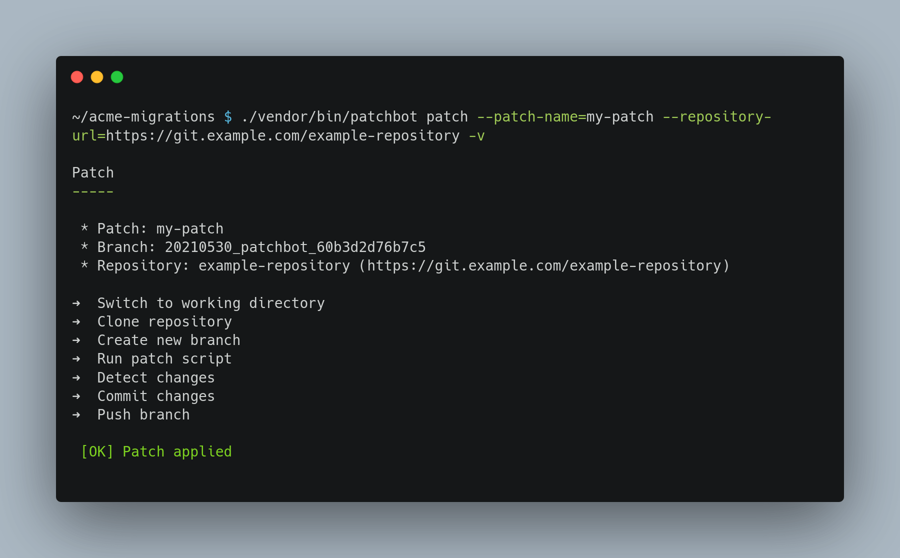

# Patchbot


[](https://packagist.org/packages/pixelbrackets/patchbot/)
[](https://gitlab.com/pixelbrackets/patchbot/pipelines)
[](https://gitlab.com/pixelbrackets/patchbot#requirements)
[](https://spdx.org/licenses/GPL-2.0-or-later.html)
[](https://gitlab.com/pixelbrackets/patchbot/-/blob/master/CONTRIBUTING.md)

A tool to automate the distribution of patches to various Git repositories.



_⭐ You like this package? Please star it or send a tweet. ⭐_

## Vision

This project provides a tool to distribute changes to a several Git repositories
with as little manual work as possible.

The need for this came up when I had to apply the same manual changes to many
of my repositories:

- Rename files having a certain name pattern, remove a line of code
  only if a condition matches, replace a link in all documents, execute another
  tool which then changes files and so on. Nothing a plain 
  [Git patch file](https://git-scm.com/docs/git-format-patch/2.7.6) could solve,
  but something that could be automated nevertheless with a migration script.
- Create a feature branch, commit all changes with a good commit message,
  push the branch, wait for tests to turn green, open a pull request.
- Repeat the same steps in many other repositories.

The idea is to do the changes only once and move the repetitions to a tool.
Saving time, preventing careless mistakes and shun monotonous work.

📝 Take a look at this
[blog post with real world examples](https://pixelbrackets.de/notes/distribute-patches-to-many-git-repositories-with-patchbot)
and how Patchbot helps to reduce technical debt across your own Git
repositories.

See [»Usage«](#usage) for example commands.

The package follows the KISS principle.

## Requirements

- PHP
- Git

## Installation

Packagist Entry https://packagist.org/packages/pixelbrackets/patchbot/

- `composer require pixelbrackets/patchbot`

💡 Or use the 
[skeleton package](https://packagist.org/packages/pixelbrackets/patchbot-skeleton/)
to create an example project right away.

- `composer create-project pixelbrackets/patchbot-skeleton`

## Source

https://gitlab.com/pixelbrackets/patchbot/

Mirror https://github.com/pixelbrackets/patchbot/

## Usage

Patchbot patches a given Git repository.

This means it will clone the repository, create a feature branch,
run a given PHP patch script, commit the changes with a given commit message
and push the branch.

🔑 The user running Patchbot needs to have access to the target repository.

Patchbot uses a lean file structure to organize patches (see
[skeleton package](https://packagist.org/packages/pixelbrackets/patchbot-skeleton/)).

The directory `patches` contains a collection of all “patch directories“.

Each patch directory always contains at least a PHP script named `patch.php`
and a commit message named `commit-message.txt`. 

Example file structure:
```
.
|-- patches
|   |-- template
|   |   |-- commit-message.txt
|   |   `-- patch.php
|   `-- yet-another-patch
|       |-- commit-message.txt
|       `-- patch.php
|-- vendor
|   `-- bin
|       `-- patchbot
|-- composer.json
`-- README.md
```

### Apply patch

Pass the name of the patch directory as `patch-name` and the Git repository as
`repository-url` to the `patchbot` script.

Example command applying the patch script in directory `template` to
the repository `https://git.example.com/repository`:
```bash
./vendor/bin/patchbot patch --patch-name=template --repository-url=https://git.example.com/repository
```

Example command to create the feature branch based on the branch `development`
instead of the default main branch:
```bash
./vendor/bin/patchbot patch --source-branch=development --patch-name=template --repository-url=https://git.example.com/repository
```

Example command to use the custom name `feature-1337-add-license-file` for 
the feature branch instead of a random name:
```bash
./vendor/bin/patchbot patch --branch-name=feature-1337-add-license-file --patch-name=template --repository-url=https://git.example.com/repository
```

It is recommend to let a CI run all tests, that's why Patchbot creates a feature
branch by default. If you want to review changes manually before the commit,
then use the `halt-before-commit` option:

```bash
./vendor/bin/patchbot patch --halt-before-commit --patch-name=template --repository-url=https://git.example.com/repository
```

### Merge feature branch

When you reviewed the feature branch and all tests are successful then
you can use Patchbot again to merge the feature branch.

Example command to merge branch `bugfix-add-missing-lock-file` into
branch `main` in repository `https://git.example.com/repository`:
```bash
./vendor/bin/patchbot merge --source=bugfix-add-missing-lock-file --target=main --repository-url=https://git.example.com/repository
```

### Add a new patch

- Copy the patch template folder `template` and rename it as desired
- Replace the commit message in `commit-message.txt`
- Replace the patch code in `patch.php`

- 🛡 ️Patchbot runs the patch script isolated, as a consequence
  it is possible to run the script without Patchbot
  - 💡 Tip: Switch to a development repository,
    run `php <path to patch directory>/patch.php` and develop the patch
    incrementally - when it's finished commit it and use Patchbot to
    distribute it to all other repositories
- The patch code will be executed in the root directory scope of the target
  repository, keep this in mind for file searches

### Share a patch

The patches created the patch directory are probably very specific to your
organisation or domain. Since a motivation for this tool was to reuse
migration scripts, you could share general-purpose scripts with others though.

One possible way is to create a Gist for a single patch.

Example command using the CLI gem [gist](https://github.com/defunkt/gist)
to upload the `template` patch:
```bash
cd patches/template/
gist -d "Patchbot Patch »template« - Just a template without changes" patch.php commit-message.txt
```

🔎 Search for [Gists with Patchbot tags](https://gist.github.com/search?l=PHP&q=%23patchbot).

### Import a patch

Copy & paste all files manually to import an existing patch from another source.

If the source is a Git repository then a Git clone command is sufficient.

Example command importing the Gist
`https://gist.github.com/pixelbrackets/98664b79c788766e4248f16e268c5745` as
patch `add-editorconfig`:
```bash
git clone --depth=1 https://gist.github.com/pixelbrackets/98664b79c788766e4248f16e268c5745 patches/add-editorconfig/
rm -r patches/add-editorconfig/.git
```

## License

GNU General Public License version 2 or later

The GNU General Public License can be found at http://www.gnu.org/copyleft/gpl.html.

## Author

Dan Untenzu (<mail@pixelbrackets.de> / [@pixelbrackets](https://pixelbrackets.de))


See [CHANGELOG.md](./CHANGELOG.md)

## Contribution

This script is Open Source, so please use, share, patch, extend or fork it.

[Contributions](./CONTRIBUTING.md) are welcome!

## Feedback

Please send some [feedback](https://pixelbrackets.de/) and share how this
package has proven useful to you or how you may help to improve it.
